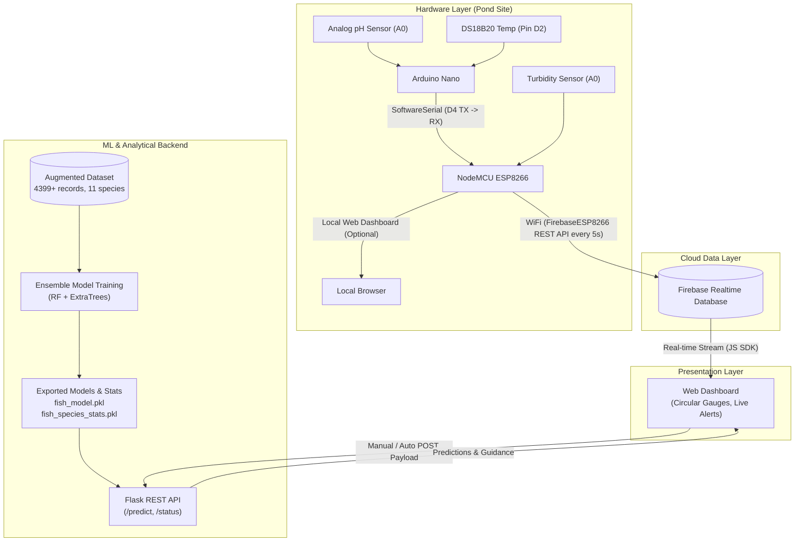

# AQUA·INTELLIGENCE 🐟💧
> **Smart Aquaculture Monitoring & Predictive Analytics System**  
> *Real-time IoT Water Quality Telemetry, Machine Learning Viability Prediction & Intelligent Aquaponics Management*

[](#)
[](https://www.python.org/)
[](#hardware-specifications--wiring)
[](#firebase-data-architecture)
[](#machine-learning-architecture)

---

## 📌 Executive Summary

**AQUA·INTELLIGENCE** is an end-to-end smart aquaculture and aquaponics monitoring ecosystem designed to eliminate guesswork and manual sampling in fish farming. By coupling multi-sensor telemetry (pH, temperature, turbidity, estimated electrical conductivity) with supervised machine learning algorithms, the platform predicts which fish and herb/spice species are best suited for current pond conditions, identifies physiological water risks, and delivers actionable mitigation guidance through a live, responsive web dashboard.

---

## 🏗️ System Architecture

The project is structured into four cohesive layers:



---

## 🔌 Hardware Specifications & Wiring

### Bill of Materials (BOM)

| Component | Part Description | Interface / Protocol | Pin Assignment |
| :--- | :--- | :--- | :--- |
| **Microcontroller 1** | Arduino Nano (ATmega328P) | Main Sensor Acquisition | Master to DS18B20 & pH |
| **Microcontroller 2** | NodeMCU ESP8266 (ESP-12E) | IoT Gateway & Cloud Telemetry | Wi-Fi 802.11 b/g/n, Firebase REST |
| **pH Sensor Module** | Analog pH probe & signal board | Analog Signal (0 - 5V) | Arduino Nano `A0` |
| **Temperature Sensor** | Dallas DS18B20 Waterproof | 1-Wire Digital (4.7kΩ pullup) | Arduino Nano `D2` |
| **Turbidity Sensor** | Optical Turbidity Module | Analog Signal (0 - 3.3V) | ESP8266 `A0` (ADC0) |
| **Local Display (Optional)** | 16×2 Character LCD with I2C PCF8574 | I2C Protocol | Nano `A4` (SDA), `A5` (SCL) |
| **Power Supply** | 5V DC 2A Regulated Power Supply | Common Ground & 5V Rail | `VIN` / `5V` pins |

### Inter-Board Communication & Wiring

```
[ Arduino Nano ]                      [ NodeMCU ESP8266 ]
  GND ----------------------------------- GND (Common Ground)
  D4 (SoftwareSerial TX) ---------------> RX / GPIO3 (Serial Receive)
  D3 (SoftwareSerial RX) <--------------- TX / GPIO1 (Optional Feedback)
  5V  <=================================> 5V External Rail

[ Arduino Nano Sensor Pins ]
  Pin A0 <---- pH Sensor Analog Output
  Pin D2 <---- DS18B20 Yellow Data Line (with 4.7kΩ pull-up to 5V)

[ ESP8266 Sensor Pins ]
  Pin A0 <---- Turbidity Sensor Analog Output (3.3V limit)
```

---

## 🤖 Machine Learning Architecture

### 1. Dataset & Supported Species
- **Source Dataset:** `fish_dataset_clean_augmented.csv` (4399+ records)
- **11 Cultivable Fish Species:**
  - `Tilapia`, `Rui`, `Pangas`, `Silver Cup`, `Katla`, `Sing`, `Shrimp`, `Karpio`, `Prawn`, `Koi`, `Magur`
- **Data Augmentation:** Sensor-grade Gaussian noise injection based on real hardware tolerance:
  - pH: $\sigma = 0.05$
  - Temperature: $\sigma = 0.30 ^\circ\text{C}$
  - Turbidity: $\sigma = 0.15\text{ NTU}$

### 2. Feature Engineering Pipeline
From 3 raw sensor readings, the system derives 16 high-dimensional features:
- **Dissolved Oxygen (DO):** $\text{DO} = \text{clip}(8 - 0.1 \times T - 0.05 \times \text{Turbidity}, 3, 8)$
- **Biological Oxygen Demand (BOD):** $\text{BOD} = \text{clip}(5 - 0.5 \times \text{DO}, 1, 6)$
- **Polynomial & Interaction Terms:** $\text{pH}^2$, $\text{Temp}^2$, $\text{Turbidity}^2$, $\text{pH} \times \text{Temp}$, $\text{pH} \times \text{Turb}$, $\text{Temp} \times \text{Turb}$.

### 3. Model Performance
- **Primary Model:** Soft-voting Ensemble (`RandomForestClassifier` + `ExtraTreesClassifier`).
- **Cross-Validation (5-Fold Stratified):** ~86.2% mean accuracy.
- **Per-Species Statistics (`fish_species_stats.pkl`):** Tracks $\mu$, $\sigma$, min, max across all parameters for each species, enabling real-time **Dataset Comparison Alerts** (flagging anomalies against historical norms).
- **Herb / Spice Model:** Secondary classifier matching pH, temperature, and derived Electrical Conductivity (EC) to companion aquaponic crops (e.g., Basil, Mint, Coriander, Water Spinach).

---

## ☁️ Firebase Data Architecture

The Firebase Realtime Database acts as the central state hub:

```json
{
  "aquaculture": {
    "sensors": {
      "ph": 7.20,
      "temperature": 27.50,
      "turbidity": 4.80,
      "ec": 1.25,
      "timestamp": 1713440000
    },
    "analysis": {
      "predicted_fish": "Tilapia",
      "confidence": 0.92,
      "predicted_spice": "Basil",
      "risk_level": "LOW",
      "water_status": "Good",
      "advice": [
        "✅ pH optimal (7.2)",
        "✅ Temperature within comfortable range (27.5°C)",
        "✅ Water clarity suitable for feeding"
      ],
      "ideal_for": ["Tilapia", "Rui"],
      "avoid_for": ["Koi"],
      "dataset_alerts": [
        "✅ All parameters align with species historical standard deviations"
      ],
      "updated_at": 1713440000
    },
    "history": {
      "-Nx102847": {
        "ph": 7.2,
        "temperature": 27.5,
        "turbidity": 4.8,
        "timestamp": 1713440000
      }
    }
  }
}
```

---

## 💻 Interactive Web Dashboard Features

1. **Modern Component Stack:** Powered by **React 18 + Vite**, leveraging **Framer Motion** for spring physics transitions and **Recharts** for real-time telemetry streaming.
2. **Dual Operating Modes:**
   - **Auto Mode:** Real-time stream synced directly from Firebase Realtime Database with an animated pulse beacon and latency watchdog.
   - **Manual Simulation Mode:** Interactive slider studio for simulating "what-if" pond scenarios with instantaneous ML inference.
3. **Interactive Telemetry Gauges:** Dynamic SVG circular meters for pH, Temperature, Turbidity, and EC with color-coded safety arcs (Optimal / Warning / Critical).
4. **Historical Analytics & Multi-Stream Charts:** Synchronized area charts visualizing trends over 15m, 1h, and 24h rolling windows.
5. **Species Viability Matrix & Companion Aquaponics:**
   - Primary predicted fish species hero badge with dynamic avatar and confidence indicator.
   - Aquaponic companion herb/spice compatibility card.
   - Searchable ranking table for all 11 fish species with star ratings and suitability percentages.
6. **Smart Actionable Advisory:** Color-coded remedial actions (liming, aeration, water exchange) and one-click PDF/CSV status export.
7. **Premium Glassmorphic Aesthetics:** Deep ocean color palette, luminous neon accents, and fluid dark/light theme switcher.

---

## 📂 Repository File Structure

```
Aquaculture/
│
├── AQUA_INTELLIGENCE_Project_Report.docx  # Comprehensive project report & specifications
├── README.md                              # Main project documentation (this file)
├── TODOS.md                               # Actionable project implementation roadmap
│
├── backend/                               # Server, Firmware & ML Pipeline
│   ├── .env                               # Backend environment variables
│   ├── arduino.ino                        # Arduino Nano sensor acquisition firmware
│   ├── Esp8266.ino                        # ESP8266 WiFi & Firebase sync gateway firmware
│   ├── fish_classification_v2.py          # ML experimentation, training & feature pipeline
│   ├── fish_dataset_clean_augmented.csv   # Cleaned & augmented training dataset
│   ├── app.py                             # Flask REST API server (/predict, /status)
│   ├── train_and_export.py                # Standalone script to train & export pkl models
│   └── requirements.txt                   # Python backend dependencies
│
└── frontend/                              # Interactive React + Vite Web Application
    ├── .env                               # Frontend Firebase & API configurations
    ├── package.json                       # React, Vite, Framer Motion, Recharts, Lucide
    ├── vite.config.js                     # Vite build configuration
    ├── index.html                         # Application mount point & typography
    └── src/
        ├── App.jsx                        # Main dashboard shell & mode controller
        ├── index.css                      # Glassmorphism design tokens & themes
        ├── components/
        │   ├── Header.jsx                 # Mode toggle, live beacon & theme switch
        │   ├── TelemetryGauges.jsx        # Animated circular gauges (pH, Temp, Turb, EC)
        │   ├── AnalyticsCharts.jsx        # Recharts live multi-parameter trend graphs
        │   ├── PredictionHero.jsx         # Primary species hero & confidence badge
        │   ├── WaterAdvisory.jsx          # Actionable remediation cards & alerts
        │   ├── SpeciesMatrix.jsx          # Searchable 11-species viability grid
        │   └── SimulationStudio.jsx       # Interactive slider simulation sandbox
        └── hooks/
            └── useAquacultureStream.js    # Firebase live stream & watchdog hook
```

---

## 🚀 Getting Started

### 1. Prerequisites
- **Arduino IDE 2.x** with ESP8266 board support and libraries:
  - `FirebaseESP8266` (by Mobizt)
  - `OneWire` & `DallasTemperature`
  - `SoftwareSerial`
  - `ArduinoJson` (v6)
- **Python 3.9+** and pip
- **Firebase Account** with a Realtime Database instance

### 2. Backend & ML Setup
```bash
# Navigate to backend directory
cd backend

# Create and activate virtual environment
python -m venv venv
venv\Scripts\activate   # On Windows
# source venv/bin/activate  # On Linux/macOS

# Install dependencies
pip install -r requirements.txt

# Configure environment variables
# Copy .env template and fill your Firebase credentials
```

### 3. Firmware Flashing
1. **Arduino Nano:** Open `backend/arduino.ino` in Arduino IDE, select `Arduino Nano (ATmega328P)`, choose COM port, and upload.
2. **ESP8266:** Open `backend/Esp8266.ino` in Arduino IDE, update your WiFi SSID/Password and Firebase credentials, select `NodeMCU 1.0 (ESP-12E Module)`, and upload.

### 4. Running the Dashboard
```bash
# Start Flask backend server
python app.py
```
Open your browser and navigate to `http://localhost:5000` (or open `frontend/index.html` via a static local web server).

---

## 🛠️ Environment Configuration

### `backend/.env`
```ini
FLASK_APP=app.py
FLASK_ENV=development
PORT=5000
FIREBASE_DATABASE_URL=https://<your-project-id>-default-rtdb.firebaseio.com/
FIREBASE_API_KEY=<your-firebase-web-api-key>
```

### `frontend/.env` (or `firebase-config.js`)
```javascript
const firebaseConfig = {
  apiKey: "<your-api-key>",
  authDomain: "<your-project-id>.firebaseapp.com",
  databaseURL: "https://<your-project-id>-default-rtdb.firebaseio.com",
  projectId: "<your-project-id>",
  storageBucket: "<your-project-id>.appspot.com",
  messagingSenderId: "<sender-id>",
  appId: "<app-id>"
};
```

---

## Tools Used
- Built with open-source tools: [scikit-learn](https://scikit-learn.org/), [Flask](https://flask.palletsprojects.com/), [Firebase](https://firebase.google.com/), and [Mobizt FirebaseESP8266](https://github.com/mobizt/Firebase-ESP8266).
